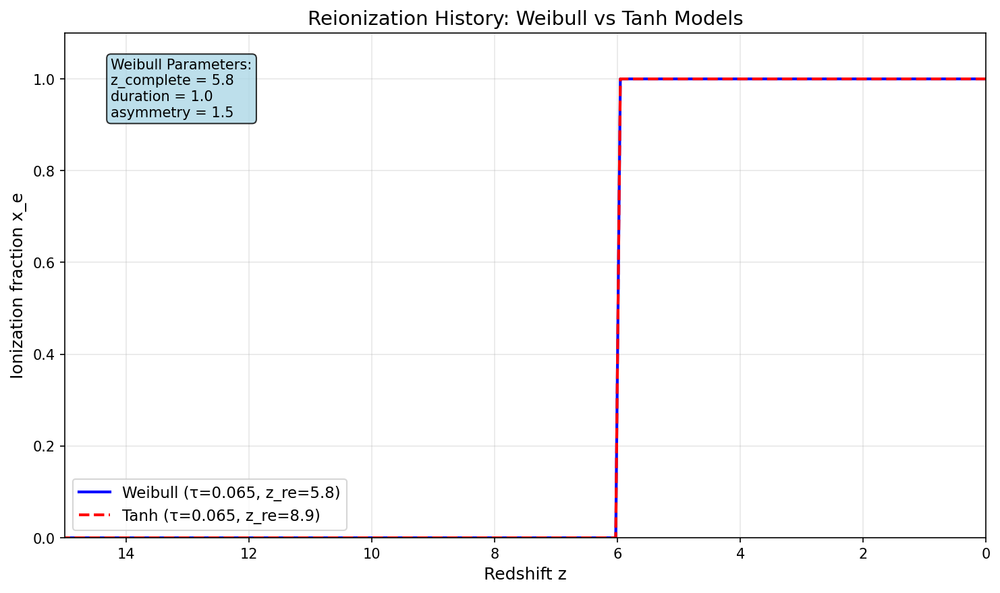

# CAMB Examples

This directory contains example scripts demonstrating various CAMB features.

## Weibull Reionization Model

### `plot_weibull_reionization.py`

Example script showing how to use the Weibull reionization model implemented following [arXiv:2505.15899v1](https://arxiv.org/abs/2505.15899).

**Usage:**
```bash
python plot_weibull_reionization.py
```

**Features:**
- Demonstrates WeibullReionization model setup
- Compares Weibull vs Tanh reionization models
- Shows typical ionization history from z=0 to z=15
- Generates publication-quality plots

**Output:**
- `weibull_reionization_history.png`: Comparison plot of ionization histories

**Model Parameters:**
- `reion_redshift_complete`: Redshift where reionization is complete (5% neutral)
- `reion_duration`: Duration parameter (Δz₉₀)
- `reion_asymmetry`: Asymmetry parameter (A_z)

The Weibull model provides more flexibility than the standard Tanh model for modeling asymmetric reionization histories, particularly useful for studies involving Lyα forest constraints and 21cm observations.

### Example Output



The plot shows the ionization fraction x_e as a function of redshift for both the Weibull and Tanh models with the same optical depth (τ = 0.065). Note how the Weibull model allows for different reionization redshifts and shapes compared to the symmetric Tanh model.
